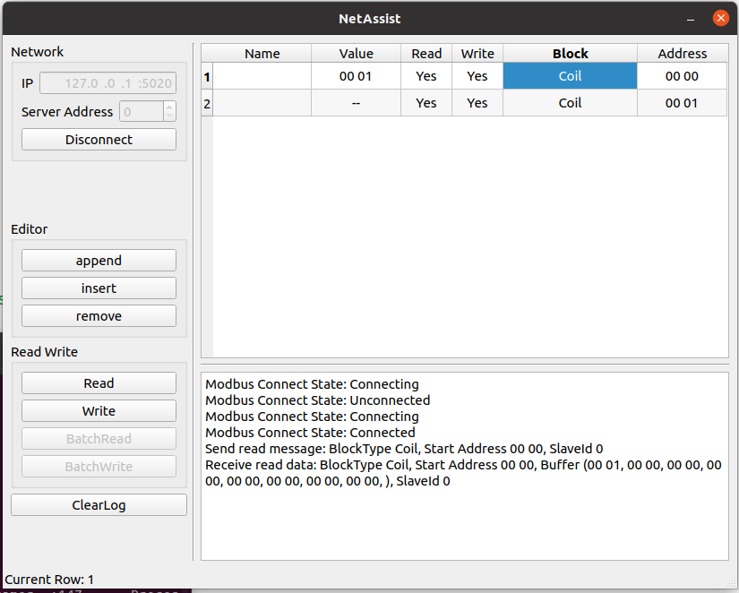

# NetAssist

## Requirement

- Ubuntu 20.04
- Qt6.2.4

## Installation

- Download realse package
- Run `./NetAssist.sh`

## Key Features

- Modbus TCP Client
  - Read Write
  - One master one slave

## TODO

- Modbus TCP Client
  - Batch Read
  - Batch Write
  - One master multi slave communication
- Modbus TCP Server
- Modbus RTU 
- TCP
- UDP
