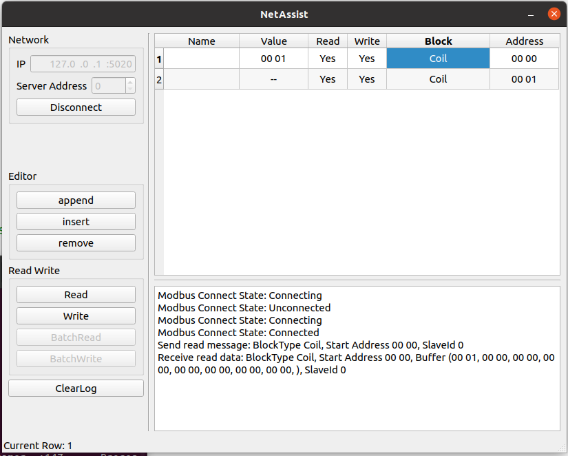

# 网络调试助手

## 开发环境

- Ubuntu 20.04
- Qt6.2.4

## 安装

- 下载发布版本
- 运行 `./NetAssist.sh`

## 主要功能

- Modbus TCP 客户端
  - 读写
  - 一主一从

## TODO

- Modbus TCP 客户端
  - 批量读
  - 批量写
  - 一主多从通讯
- Modbus TCP 服务端
- Modbus RTU 
- TCP
- UDP
